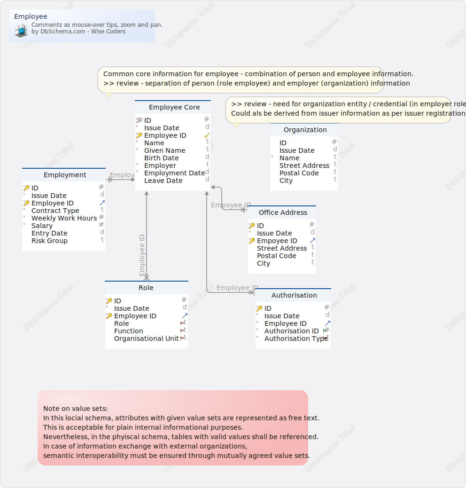

#Employee
Generated using [DbSchema](https://dbschema.com)

### Employee

### Entity INSTANCE.Authorisation 
| | | | |
|---|---|---|---|
| * &#128273;  | ID| BIGINT  | Technical ID assigned through VC issuing process.\Note - not stable; re-assigned with every revocation / re-issuing cycle. |
| * | Issue Date| DATE  |  |
| * &#11016; | Employee ID| VARCHAR(30)  | Exact string match required for reference (upper/lower case, whate spaces, ...). |
| * | Authorisation ID| INT  | &gt;&gt; review - separate identifier required? |
| * | Authorisation Type| VARCHAR(100)  | &gt;&gt; Review - valid value set? Alternatively use predefined code instead of free text. |

##### Indexes 
| | | |
|---|---|---|
| &#128273;  | pk\_Authorisation | ON ID|

##### Relationships
| | | |
|---|---|---|
|  | Authorisation - Employee Core | ( Employee ID ) ref [INSTANCE.Employee Core](#Employee Core) (Employee ID) |

### Entity INSTANCE.Employee Core 
Common core information for employee.
&gt;&gt; review - separation of person (role employee) and employer (organization) information

| | | | |
|---|---|---|---|
| * &#128269; | ID| BIGINT  | Technical ID assigned through VC issuing process.\Note - not stable; re-assigned with every revocation / re-issuing cycle. |
| * | Issue Date| DATE  | Issue of VC. |
| * &#128273;  &#11019; | Employee ID| VARCHAR(30)  | ID assigned by employer.\\Employee ID must be known to issue certificate - used as reference by extended certificates. |
| * | Name| VARCHAR(100)  | Aliases - last name, family name |
| * | Given Name| VARCHAR(100)  | Alias - first name |
|  | Birth Date| DATE  | Alias - date of birth (DOB) |
| * | Employer| VARCHAR(100)  | Employer name (note - alternatively, an employer number could be used). |
| * | Employment Date| DATE  | Based on contract. |
|  | Leave Date| DATE  |  |

##### Indexes 
| | | |
|---|---|---|
| &#128269;  | pk\_Employee Core | ON ID|
| &#128273;  | pk\_Employee Core\_0 | ON Employee ID|

### Entity INSTANCE.Employee Extended 
| | | | |
|---|---|---|---|
| * &#128273;  | ID| BIGINT  | Technical ID assigned through VC issuing process.\Note - not stable; re-assigned with every revocation / re-issuing cycle. |
| * | Issue Date| DATE  |  |
| * &#128273;  &#11016; | Employee ID| VARCHAR(30)  | Exact string match required for reference (upper/lower case, whate spaces, ...). |
| * | Employer| BIGINT  | Redundant onformation of «Employee Core».\&gt;&gt; Review - remove |
|  | Operation Site| VARCHAR(100)  | Free text - address or similar. |
|  | Activity Tyoe| VARCHAR(100)  | Free text.\&gt;&gt; Review - optionally based on list of values |
|  | Contact Name| VARCHAR(100)  | First name, last name\&gt;&gt; Review - what is the exact purpose of the contact? More than one contact for different activities?\&gt;&gt; Review - reference to person |
|  | Contact Phone| VARCHAR(100)  | &gt;&gt; Review - reference to person |
|  | Contact Mail| VARCHAR(100)  | &gt;&gt; Review - reference to person |

##### Indexes 
| | | |
|---|---|---|
| &#128273;  | pk\_Employee Extended | ON ID, Employee ID|

##### Relationships
| | | |
|---|---|---|
|  | Employee Extended - Employee Core | ( Employee ID ) ref [INSTANCE.Employee Core](#Employee Core) (Employee ID) |

### Entity INSTANCE.Employee Role 
| | | | |
|---|---|---|---|
| * &#128273;  | ID| BIGINT  | Technical ID assigned through VC issuing process.\Note - not stable; re-assigned with every revocation / re-issuing cycle. |
| * | Issue Date| DATE  |  |
| * &#128273;  &#11016; | Employee ID| VARCHAR(30)  | Exact string match required for reference (upper/lower case, whate spaces, ...). |
|  | Role| VARCHAR(100)  | &gt;&gt; Review - valid value set? Alternatively use predefined code instead of free text. |
|  | Function| VARCHAR(100)  | &gt;&gt; Review - valid value set? Alternatively use predefined code instead of free text. |
|  | Organisational Unit| VARCHAR(100)  | &gt;&gt; Review - valid value set? Alternatively use predefined code instead of free text. |

##### Indexes 
| | | |
|---|---|---|
| &#128273;  | pk\_Employee Role | ON ID, Employee ID|

##### Relationships
| | | |
|---|---|---|
|  | Employee Role - Employee Core | ( Employee ID ) ref [INSTANCE.Employee Core](#Employee Core) (Employee ID) |

### Entity INSTANCE.Employer Address 
| | | | |
|---|---|---|---|
| * &#128273;  | ID| BIGINT  | Technical ID assigned through VC issuing process.\Note - not stable; re-assigned with every revocation / re-issuing cycle. |
| * | Issue Date| DATE  |  |
| * &#128273;  &#11016; | Empoyee ID| BIGINT  | Exact string match required for reference (upper/lower case, whate spaces, ...). |
|  | Street Address| VARCHAR(100)  |  |
|  | Postal Code| VARCHAR(10)  |  |
|  | City| VARCHAR(100)  |  |

##### Indexes 
| | | |
|---|---|---|
| &#128273;  | pk\_Employer Address | ON ID, Empoyee ID|

##### Relationships
| | | |
|---|---|---|
|  | Employer Address - Employee Core | ( Empoyee ID ) ref [INSTANCE.Employee Core](#Employee Core) (Employee ID) |

### Entity INSTANCE.Employment 
Employment information of a person (employee).

| | | | |
|---|---|---|---|
| * &#128273;  | ID| BIGINT  | Technical ID assigned through VC issuing process.\Note - not stable; re-assigned with every revocation / re-issuing cycle. |
| * | Issue Date| DATE  |  |
| * &#128273;  &#11016; | Employee ID| VARCHAR(30)  | Exact string match required for reference (upper/lower case, whate spaces, ...). |
| * | Contract Type| ENUM(up to  364 days, 365 days and more)  |  |
| * | Weekly Work Hours| INT  | According to contract. |
| * | Salary| BIGINT  | Annual base salary, CHF. |
|  | Entry Date| DATE  | First working day. |
|  | Risk Group| VARCHAR(50)  | Official risk classification as provided by insurance industry. |

##### Indexes 
| | | |
|---|---|---|
| &#128273;  | pk\_Employment | ON ID, Employee ID|

##### Relationships
| | | |
|---|---|---|
|  | Employment - Employee Core | ( Employee ID ) ref [INSTANCE.Employee Core](#Employee Core) (Employee ID) |

### Entity INSTANCE.Organization 
&gt;&gt; review - need for organization entity / credential (in employer role)?

| | | | |
|---|---|---|---|
|  | ID| BIGINT  | Technical ID assigned through VC issuing process.\Note - not stable; re-assigned with every revocation / re-issuing |
|  | Issue Date| DATE  |  |
| * | Name| VARCHAR(100)  |  |
|  | Street Address| VARCHAR(100)  |  |
|  | Postal Code| VARCHAR(15)  |  |
|  | City| VARCHAR(100)  |  |

